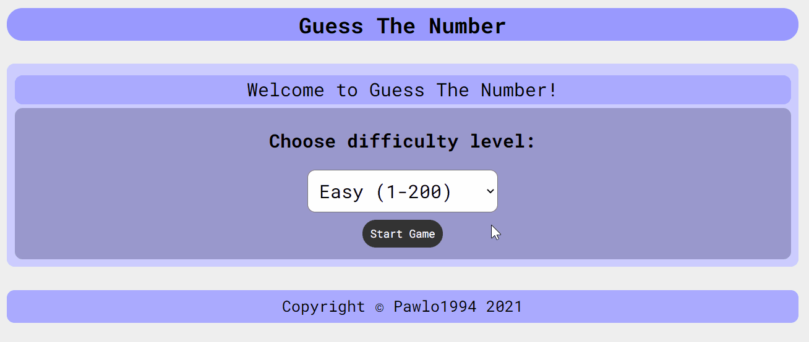
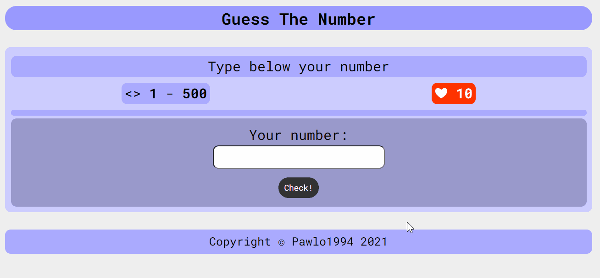

# Guess The Number Game
## Used Technologies
1. HTML
2. CSS
3. BEM
4. JavaScript

## Demo
https://pawlo1994.github.io/guess-the-number

## Description
Simple game in which you have to guess the number which have been chosen by app.

## How to use
1. Choose difficulty level from list and click "Start Game".

2. After first step, try to guess the number.
3. If your number is **too low**, you have to try type **higher** number.

4. If your number is **too high**, you have to try type **lower** number.

You have **10** chances to guess the number but remember!
If the difference between min and max number equals 0, **you will lose!**